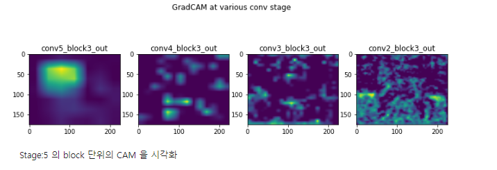
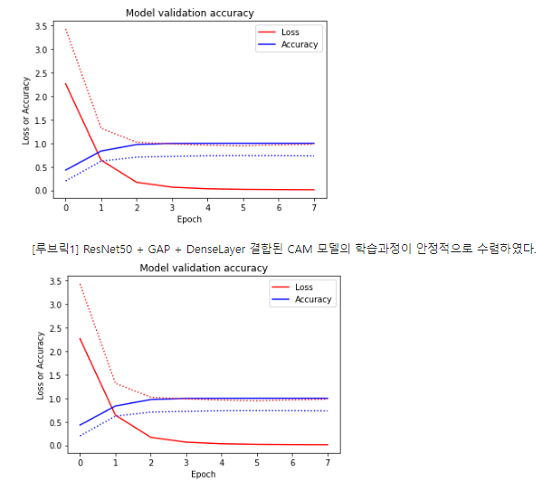
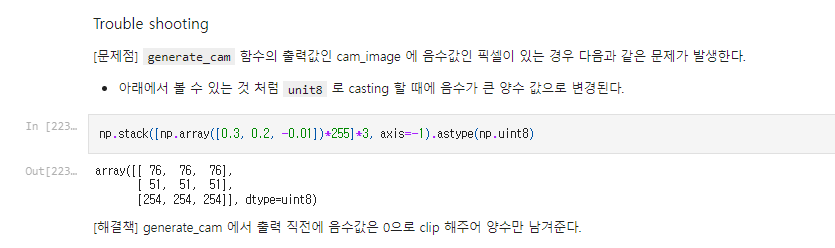
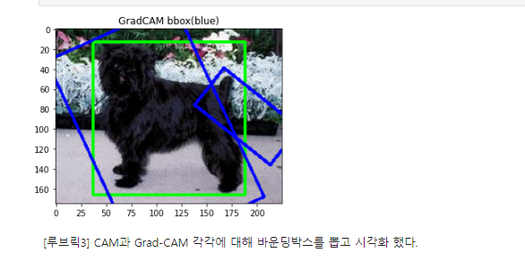
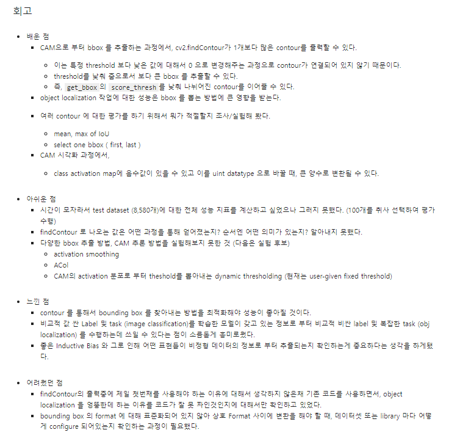

# aiffel_projects

코더: 최호재
리뷰어: 신재현

project submission for aiffel
🔑 **PRT(Peer Review Template)**

- [X`]  **1. 주어진 문제를 해결하는 완성된 코드가 제출되었나요? (완성도)**
    >  문제에서 요구하는 최종 결과물이 첨부되었는지 확인
    >  문제를 해결하는 완성된 코드란 프로젝트 루브릭 3개 중 2개, 퀘스트 문제 요구조건 등을 지칭 ( 해당 조건을 만족하는 부분의 코드 및 결과물을 캡쳐하여 사진으로 첨부 )

    

- [X]  **2. 프로젝트에서 핵심적인 부분에 대한 설명이 주석(닥스트링) 및 마크다운 형태로 잘 기록되어있나요? (설명)**
    - [X] 모델 구성과 의도의 설명이 잘 되었는가?
    - [X] 모델을 의도한 바에 적절하게 만들었는가?
    - [X]  Metrics 선정 이유
    - [X]  Loss 선정 이유
        LMS에서 디폴트로 제공하는 로스를 이유를 분석하면서 적절히 선택하셨습니다.

모델을 구성하는데 있어 적합한 에폭을 시각화와 함께 적절히 선택

기존에 배경에서 노이즈가 끼는 현상들을 원인부터 파악하여 이를 해결 하심

- [X]  **3. 체크리스트에 해당하는 항목들을 모두 수행하였나요? (문제 해결)**
    - [X]  데이터를 분할하여 프로젝트를 진행했나요? (train, validation, test 데이터로 구분)
    - [X]  하이퍼파라미터를 변경해가며 여러 시도를 했나요? (learning rate, dropout rate, unit, batch size, epoch 등)
    Threshold 및 IoU값 대신 MIoU를 활용하는 등 다양한 테스트를 진행하셨습니다.
    - [X]  각 실험을 시각화하여 비교하였나요?
    - [Xf]  모든 실험 결과가 기록되었나요?

실험중 contour가 여러개 생성된다는 것을 파악한 후 이를 연계적으로 분석해서 다시 분석하는 작업을 시행하셨습니다.

- [X]  **4. 프로젝트에 대한 회고가 상세히 기록 되어 있나요? (회고, 정리)**
    - [X]  배운 점
    - [X]  아쉬운 점
    - [X]  느낀 점
    - [X]  어려웠던 점

    